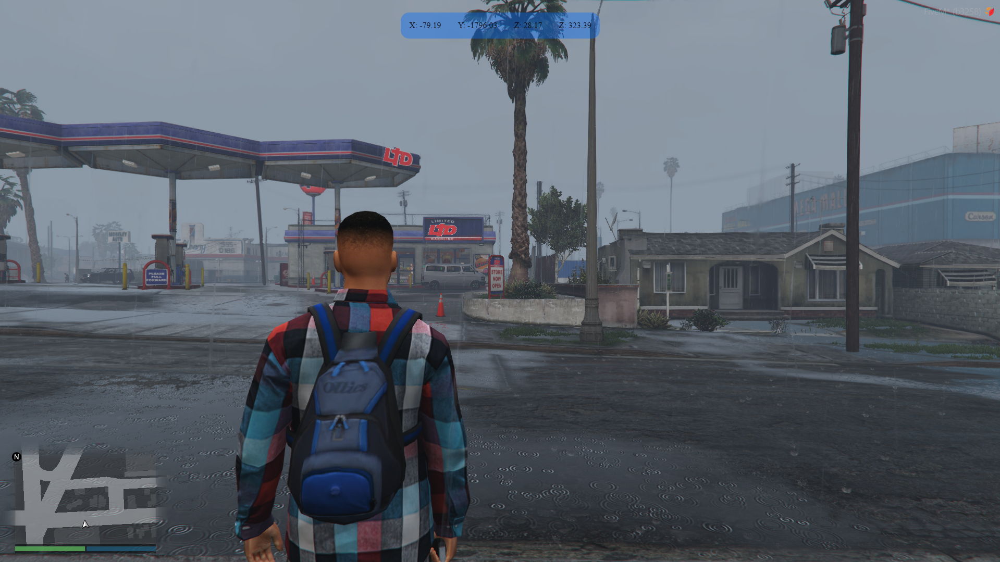

# K-COORDS (FiveM NUI)

Script simple para **mostrar las coordenadas del jugador (X, Y, Z) y heading** en una **UI HTML (NUI)** dentro de FiveM.

## ✨ Features
- UI (NUI) con HTML/CSS/JS
- Muestra coords en tiempo real (actualización configurable)
- Comando para abrir/cerrar la UI
- Preparado para animaciones CSS (clases activo/noActivo)

## 📦 Requisitos
- Servidor **FiveM** (fx_version `cerulean`)
- Un recurso con NUI (`ui_page` + `files`) configurado en el `fxmanifest.lua`

## 🛠️ Instalación
1. Descarga o clona este repositorio.
2. Mete la carpeta del recurso en:
   - `resources/` (o donde tengas tus recursos)
3. Asegúrate de iniciarlo en tu `server.cfg`

